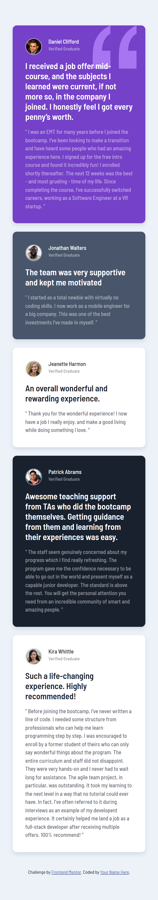
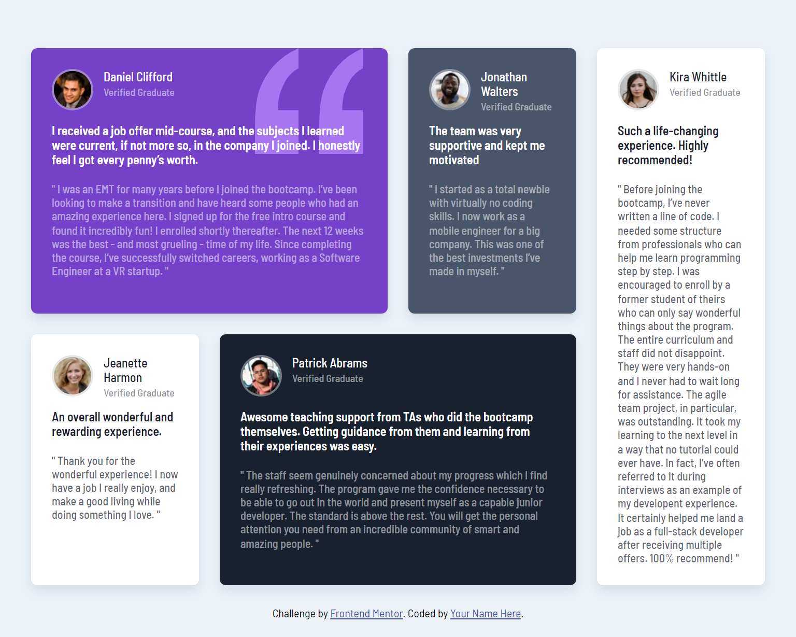
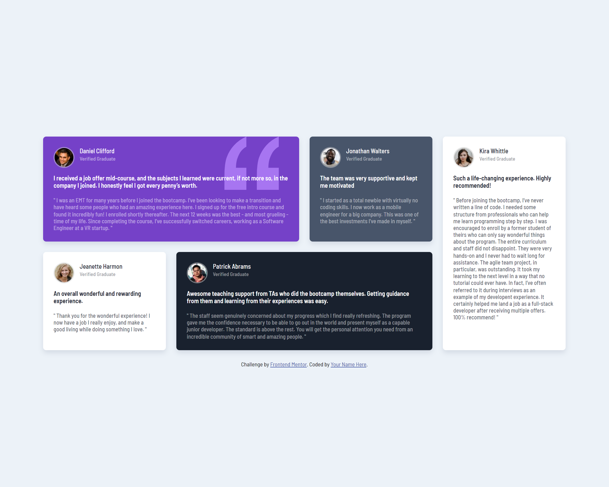

# Frontend Mentor - Testimonials grid section solution

This is a solution to the [Testimonials grid section challenge on Frontend Mentor](https://www.frontendmentor.io/challenges/testimonials-grid-section-Nnw6J7Un7). Frontend Mentor challenges help you improve your coding skills by building realistic projects.

## Table of contents

- [Overview](#overview)
  - [The challenge](#the-challenge)
  - [Screenshot](#screenshot)
  - [Links](#links)
- [My process](#my-process)
  - [Built with](#built-with)
  - [What I learned](#what-i-learned)
  - [Continued development](#continued-development)
  - [Useful resources](#useful-resources)
- [Author](#author)

**Note: Delete this note and update the table of contents based on what sections you keep.**

## Overview

### The challenge

Users should be able to:

- View the optimal layout for the site depending on their device's screen size

### Screenshot

### Links

- Solution URL: [GitHub repo](https://github.com/sammie-create/testimonials-grid-section-main)
- Live Site URL: [Live page](https://sammie-create.github.io/testimonials-grid-section-main/)

## My process

### Built with

- Semantic HTML5 markup
- CSS custom properties
- CSS Grid
- Mobile-first workflow

### What I learned

The peculiarities of the CSS Grid

### Continued development

I need to get better at using the CSS Grid and also responsive design

### Useful resources

- [Example resource 1](https://www.w3schools.com) - My go to resource

## Author

- Frontend Mentor - [@ysammie-create](https://www.frontendmentor.io/profile/sammie-create)
